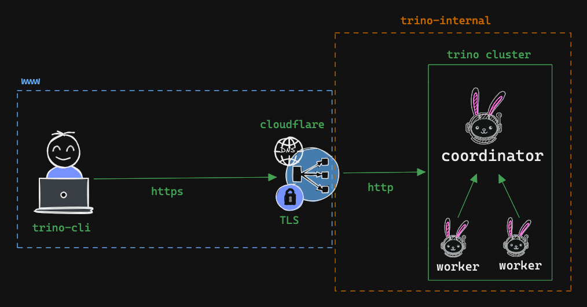

## Trino Security

This github repository describes how to implement google oauth for Trino cluster.

### Considerations

- To configure security for Trino cluster, it's mandatory to enable TLS/HTTPS.
- Here I used [Cloudflare Tunnel](https://www.cloudflare.com/en-gb/products/tunnel/) as reverse proxy to expose Trino cluster to the internet with HTTPS. [Read More](https://trino.io/docs/current/security/tls.html#approaches)
- I have used [Google OAuth](https://developers.google.com/identity/protocols/oauth2) for this example, but you can use any other OAuth provider (Microsoft, Okta, etc).

### Trino Security Architecture (Docker)



### Running Trino Cluster locally

#### Prerequisites

- Cloudflare Tunnel. Please follow the steps mentioned [here](https://youtu.be/ey4u7OUAF3c) by NetworkChuck on YouTube. Get a `cloudflare access token` from Zero Trust.

- Google OAuth Client ID and Secret. Please follow this [guide](https://developers.google.com/identity/protocols/oauth2/web-server).

#### Running Trino Cluster with Docker Compose

```bash
docker-compose up -d
```

#### Executing query with Trino CLI

Executing query with Trino CLI is bit tricky. You need to use `--external-authentication` flag and you need to provide your mail id as username with `--user` flag. Otherwise, you will `Access Denied: impersonation` error.

```bash
trino --server https://{{cloudflare-tunnel-url}} --external-authentication --user {{your-email-id}}
```

### Recommended Reading

- [Trino Security](https://trino.io/docs/current/security/overview.html)
- [Trino TLS Configuration](https://trino.io/docs/current/security/tls.html)
- [Trino OAuth2 Docs](https://trino.io/docs/current/security/oauth2.html)
- [Secrets Management in Trino](https://trino.io/docs/current/security/secrets.html)

### Troubleshooting

- [Google OAuth Issues with trino](https://github.com/trinodb/trino/issues/7322)
- [End Session Property Trino](https://github.com/trinodb/trino/discussions/19490)
- [Google OpenID Configuration](https://accounts.google.com/.well-known/openid-configuration)
- [Oauth2 Principal Field](https://github.com/trinodb/trino/issues/7526)
- [Impersonation Error](https://github.com/trinodb/trino/issues/18935)

---

Made with ❤️ by [nil1729](https://github.com/nil1729)
